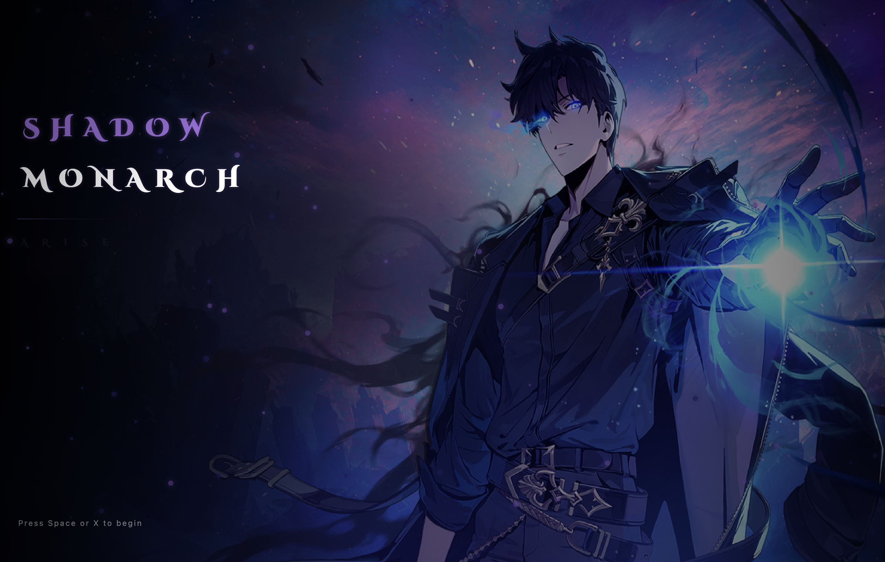
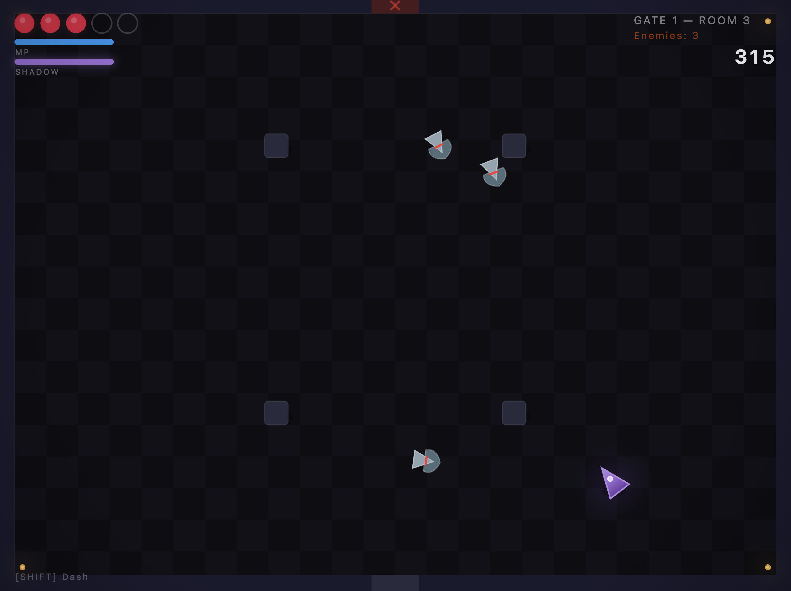
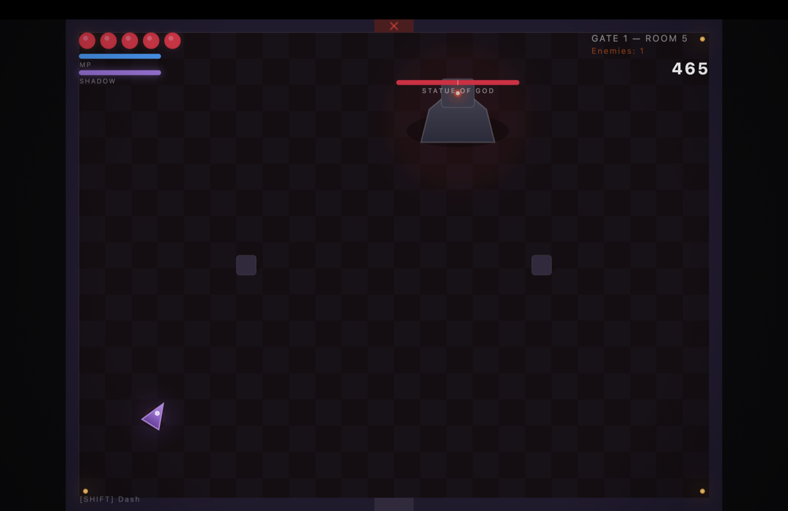
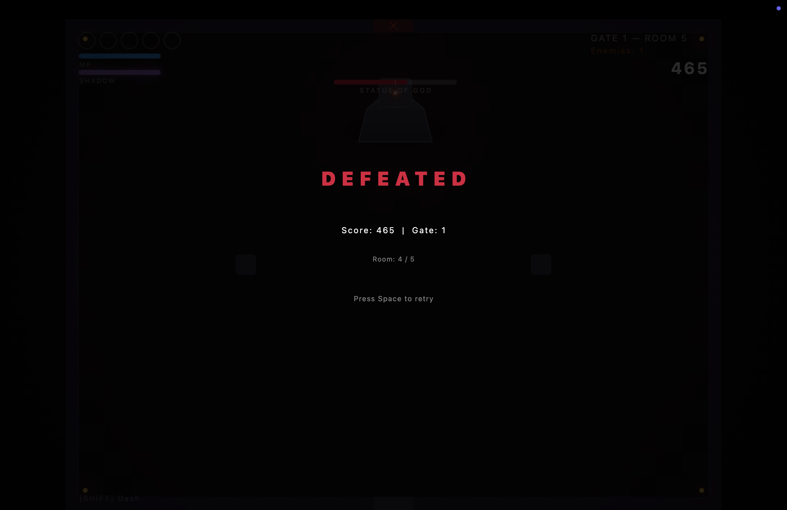

# SHADOW MONARCH

> Solo Leveling Dungeon Crawler | Flutter + Flame + CustomPainter



## About

Shadow Monarch is a top-down dungeon crawler inspired by **Solo Leveling**. Play as Sung Jin-Woo — clear gates, fight magic beasts, and extract shadows.

Built with **Flutter**, **Flame**, and **CustomPainter** for cinematic effects. Supports keyboard and PS5 DualSense gamepad.

## Features

- 3-hit combo attack system with dash mechanics
- Dire Wolf enemies with chase and lunge AI
- Escalating wave system
- Particle explosions, screen shake, damage numbers
- HUD with health, MP, and shadow gauge
- PS5 DualSense / generic gamepad support (D-pad, analog sticks, buttons)
- Atmospheric menu with Solo Leveling soundtrack

## Screenshots

<p>
  
  
  
</p>

## Running

```bash
flutter run -d macos    # desktop
```

## Controls

| Action | Keyboard | Gamepad |
|--------|----------|---------|
| Move | WASD / Arrow Keys | Left Stick / D-Pad |
| Attack | Space | X (Cross) |
| Dash | Shift | O (Circle) / R2 |
| Aim | Mouse | Right Stick |

## Roadmap

- [x] Phase 1 — Core combat in single room
- [ ] Phase 2 — Multi-room gates with doors
- [ ] Phase 3 — ARISE extraction + shadow soldiers
- [ ] Phase 4 — Progression, more enemies/bosses
- [ ] Phase 5 — Touch input
- [ ] Phase 6 — Endgame + polish
